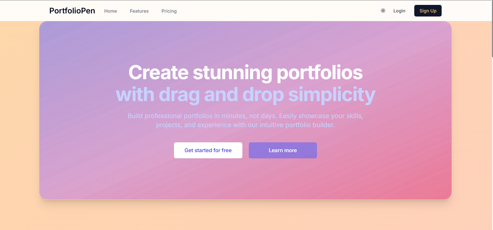

# PortfoliOpen

  
  
  
  
  
  
  
  
  
  
   
  
  
  
  

A full-stack AI portfolio builder to create, customize, and publish your personal site.

**Live Website:** https://portfoliopen.online

  

  

## Free Features
- Secure authentication and sessions
- Create, View, Edit, and Delete personal portfolio including sections
- Fast, responsive frontend (React + Tailwind)
- Sections reordering through drag and drop
- Image uploads for portfolio sections
- Authentication through traditional login and registration, and Google OAuth
- Reset password through email
- RESTful APIs with modular controllers and services
- Razorpay payment integration to become a Pro user

  

## Pro Features
- AI-assisted content generation (AI description generation, and AI skills generation)
- Downgrade anytime to free user

---

  

